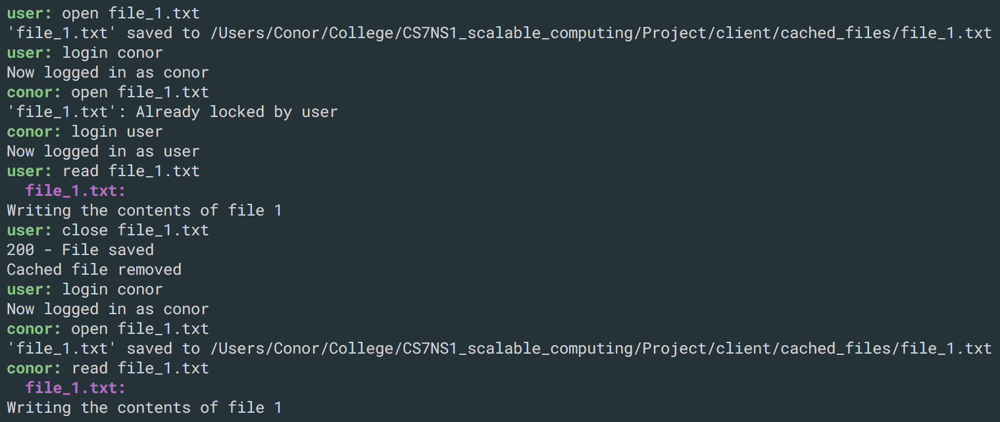

# CS7NS1 Distributed File System

Conor Maguire - 13323317

## Components implemented

- [x] File Service
- [x] Directory Service
- [x] Lock Service
- [x] Client (transparent file access)
- [x] Caching
- [x] Security Service (partial)

## Distributed File System

This is an upload/download model of distributed file system where each service is a separate Python web application written in Flask. I use docker for running the system and also for networking. Each service runs in its own Docker container and is linked to any other services it needs to communicate with via docker-compose links in the `docker-compose.yml` file. Any services which need a database are using PostgreSQL databases running as their own Docker container.

## Running

I run the distributed file system using a combination of docker, docker-machine and docker-compose.

The `launch.sh` script wil run the following two steps:

**1. Run the services**
```shell
$ docker-compose build
$ docker-compose up -d
```
**2. Create the databases**
```shell
$ docker-compose run lock-service python manage.py recreate_db
$ docker-compose run security-service python manage.py recreate_db
$ docker-compose run directory-service python manage.py recreate_db
```

**Run client**
```shell
$ cd client
$ python client.py
```

## File Service

The File Service stores static files on its own file system. It exposes an API that the Directory Service can use to manipulate the files using CRUD operations.

**API**

| HTTP verb | Endpoint | Description |
| --------- | -------- | ------------|
| GET       | /files   | Get list of all files stored on this server |
| GET | /files/:filename | Get file :filename |
| POST | /files | Save the file contained in the request body to this file server. If it already exists, overwrite it |
| DELETE | /files/:filename | Delete :filename from this server |

## Directory Service

The Directory Service is responsible for storing files on and retrieving files from the various File Servers on behalf of the client. It presents the client with a view of a flat remote file system. Due to the flat structure, a file server is chosen at random to store a file when it first gets uploaded. The Directory Service keeps a PostreSQL database of `File` objects (see below) and updates them as they are updated and deleted.

It also acts as a middle man between the client and the other services such as the lock service. It queries the Lock Service's API before granting the client access to any files. This has the advantage that does not need to query the service directly and also that they cannot ignore locks.

**File object**

```python
class File():
    id = db.Column(db.Integer, primary_key=True, autoincrement=True)
    filename = db.Column(db.String(128), nullable=False)
    url = db.Column(db.String(128), nullable=False)
```

**API**

| HTTP verb | Endpoint | Description |
| --------- | -------- | ------------|
| GET       | /files   | Get list of all files in the dfs (all file servers) |
| GET | /files/:filename | Attemp to get (open) file :filename from whichever file server it is stored on and also place a lock on it for the user. If already locked this will return an error code to the client |
| POST | /files | Upload the file contained in the request body to a random file server, storing it in the Directory Service's database |
| PUT | /files/:filename | Update (close) :filename by writing the new contents to whichever server it is stored on, and release the lock. If already locked this will return an error code to the client. 
| DELETE | /files/:filename | Delete :filename from whichever server it is stored on |

## Lock Service

Keeps a database table of `FileLock` objects (see below). If a FileLock entry exists for a particular file, then it is locked by the user in the `FileLock.user` field. If it is not in the database, then it is assumed to be unlocked.

**FileLock object**
```python
class FileLock():
    id = db.Column(db.Integer, primary_key=True, nullable=False)
    filename = db.Column(db.String(128), nullable=False)
    user = db.Column(db.String(128), nullable=False)
```

**API**

| HTTP verb | Endpoint | Description |
| --------- | -------- | ------------|
| GET       | /locks   | List of all FileLocks held by this ervice |
| GET | /locks/:id | Get the lock corresponding to file with id of :id (if it exists) |
| POST | /locks | Lock a file by storing a FileLock in the db corresponding to a file |
| DELETE | /locks/:id | Unlock file with id of :id, deleting lock from db |

## Client

The Client is a separate Python command line program that provides easy access for the DFS. All of the client's actions go through the Directory Service first and the client does not need to know the locations of any of the file servers, lock service, etc. (transparent file access). 

The standard workflow of the client is that they will list all the files on the DFS (hiding any notion of different file servers). They can then open (download) the file, caching it locally and locking the file for themselves. Any reads and writes go to this cached copy. No other user can modify the file while it is opened, due to the lock. When done editing the file, they will close it. This sends the updates to the remote copy and unlocks the file.

**Commands**


**Sample Usage**


**Sample Usage (locking)**



## Caching

Caching is performed on the client after a file is opened. Opening a file downloads it from the DFS (to the `cached_files/` directory) and locks it. Reads and writes go to the cached copy. When the file is closed, the remote copy is updated and the cached copy is deleted. The combination of locking a file and caching only while the file is opened means that no cache validation is required. Only one user can lock and cache a file so they will always have the most up to date copy.

## Security Service

I have partially implemented a token based security service. The API has been finished but it is not fully integrated with the DFS. It is responsible for registering and logging in users, as well as keeping a record of active session tokens given to users. When a user logs in, it returns a random `SessionToken` object and adds it to the database. The user would then attach this token in the headers of any request it sends to the Directory Service. The directory service would then trigger a check of this token before every request using the `@directory.before_request` decorator. This request still fires but is only a mock version which sends a dummy request to the Security Service

This is not fully implemented into the DFS. Currently, the client registers and logs in with the Security Service, but it still sends just its user name in the headers instead of the token. And the Directory Service only checks this user name for the lock service, not the security service. 

**User Model**
```python
class User(db.Model):
    id = db.Column(db.Integer, primary_key=True, nullable=False)
    username = db.Column(db.String(128), nullable=False)
    password = db.Column(db.String(128), nullable=False)
```

**SessionToken Model**
```python
class SessionToken(db.Model):
    token = db.Column(db.String(128), primary_key=True, nullable=False)
    username = db.Column(db.String(128),  nullable=False)
```

**API**

| HTTP verb | Endpoint | Description |
| --------- | -------- | ------------|
| GET       | /users   | List of all `Users` registered |
| GET | /tokens | Get list of all active `SessionTokens` |
| POST | /register | Register a new `User`|
| POST | /login | Log a user in and generate a new session token |
| POST | /logout | Log a `User` out |
| GET | /verify | Verify if the `SessionToken` contained in the header is valid or not
